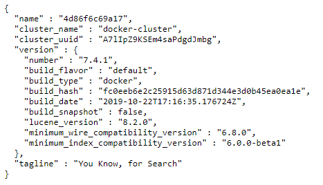
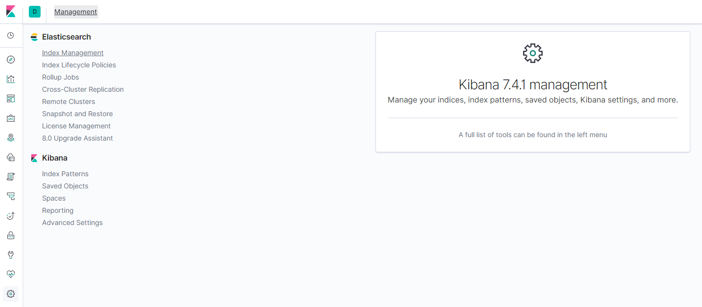
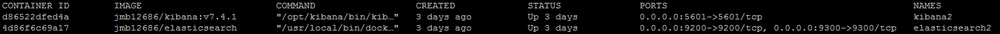

### How to launch docker ELK in raspberry4

#### Index 

1. [Prepared Docker Image](#Docker_Image)
2. [Docker Launch Command](#launch)
3. [Check](#check)

----
<a name="Docker_Image"/>

#### Prepared Docker Image

* Thanks for `jmb12686` to create great docker ELK image in raspberry4, I have spend a lot of time to find it.

1. [jmb12686/elasticsearch](https://hub.docker.com/r/jmb12686/elasticsearch)
```
docker pull jmb12686/elasticsearch:latest
```

2. [jmb12686/kibana](https://hub.docker.com/r/jmb12686/kibana)
```
docker pull jmb12686/kibana:v7.4.1
```

----
<a name="launch"/>

#### Docker Launch Command

###### 1st launch elasticsearch docker image

* -v `HostFolderPath`/elasticsearch.yml:/usr/share/elasticsearch/config/elasticsearch.yml : put [elasticsearch configure](config/elasticsearch/elasticsearch.yml)
* -v HostFolderPath/data:/usr/share/elasticsearch/data:rw : storage elasticsearch data
* -e "ES_JAVA_OPTS=-Xmx2g -Xms2g" : My suggestion is 2g, smaller than 2g may cause kibana slow...

```
sudo docker run -d \
--name elasticsearch \
--restart always \
-p 9200:9200 -p 9300:9300 \
-e "ES_JAVA_OPTS=-Xmx2g -Xms2g" \
-e "discovery.type=single-node" \
-v HostFolderPath/elasticsearch.yml:/usr/share/elasticsearch/config/elasticsearch.yml \
-v HostFolderPath/data:/usr/share/elasticsearch/data:rw \
jmb12686/elasticsearch
```

###### 2nd launch kibana docker image

* -v HostFolderPath/kibana.yml:/opt/kibana/config/kibana.yml:ro : put [kibana config](config/kibana/kibana.yml)

```
sudo docker run -d \
--restart always \
-p 5601:5601 \
--name kibana \
-v HostFolderPath/kibana.yml:/opt/kibana/config/kibana.yml:ro \
jmb12686/kibana:v7.4.1
```

-----
<a name="check"/>

#### Check

1. Check elasticsearch , please click `http://localhost:9200` and show below means it's work!



2. Check kibana, please click `http://localhost:5601` and show below means it's work!



3. Also input `docker ps -a` in your terminal to check docker status




